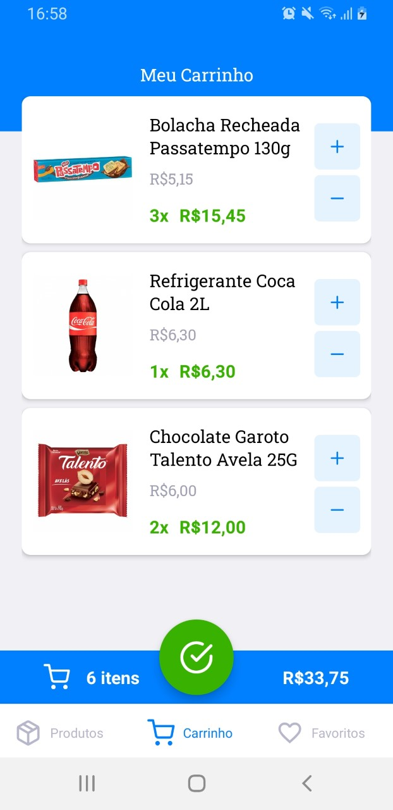
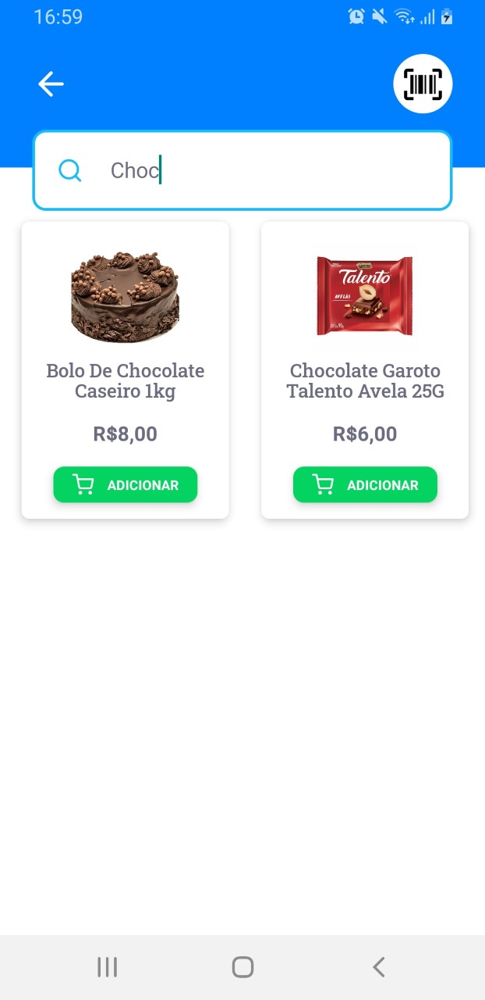

# amaralDelivery_app

  &nbsp;&nbsp;&nbsp;&nbsp;&nbsp;&nbsp;
  &nbsp;&nbsp;&nbsp;&nbsp;&nbsp;&nbsp;
  &nbsp;&nbsp;&nbsp;&nbsp;&nbsp;&nbsp;
  &nbsp;&nbsp;&nbsp;&nbsp;&nbsp;&nbsp;
  &nbsp;&nbsp;&nbsp;&nbsp;&nbsp;&nbsp;
  &nbsp;&nbsp;&nbsp;&nbsp;&nbsp;&nbsp;

## :rocket: Features
* List products
* List products that are on sale
* Filter products by name
* Add products to the cart
* Add products to favorites
* Order a list of products and select your address and schedule the delivery time and how you want o pay
* List of orders and the products that are in each order (for providers only)